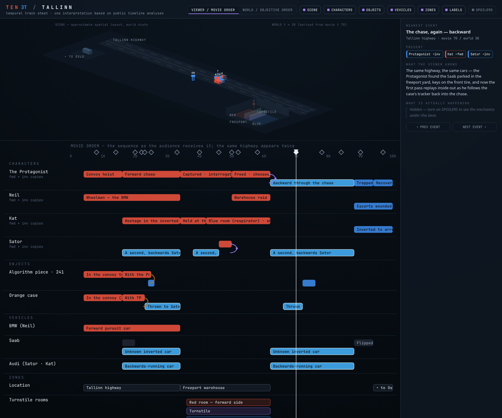
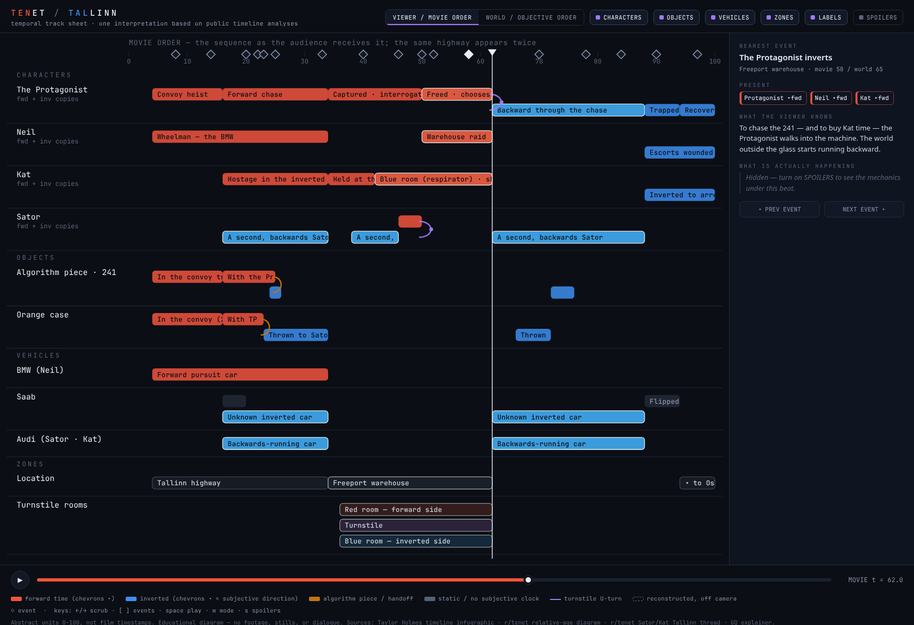
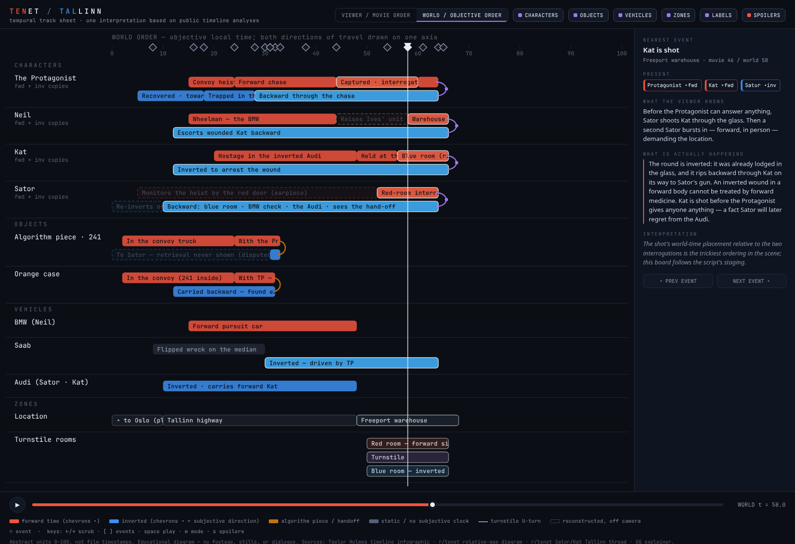

# tenet-timeline

An interactive, scrubbable timeline explainer for Christopher Nolan's *Tenet*, starting
with one scene: the Tallinn highway chase / freeport turnstile sequence.

**This is one interpretation based on public timeline analyses.** It contains no film
footage, screenshots, or dialogue — only abstract shapes, original labels, and original
summaries. It is an educational diagram of *temporal mechanics*, not a reproduction of
the film.

Open `index.html` in any modern browser. No build step, no dependencies, fully offline.

## Design brief

### The problem the visualization solves

*Tenet* runs three clocks at once and never shows you more than one:

1. **Viewer order** — the order the audience experiences shots.
2. **World order** — the objective sequence of events at the location.
3. **Subjective order** — what any one character experiences, which runs *backward*
   against world order whenever that character is inverted.

The Tallinn sequence is the film's densest collision of the three: the same stretch of
highway is on screen twice, several characters are present twice simultaneously (once
forward, once inverted), and the audience's understanding at first viewing is
deliberately wrong. A prose explainer can only serialize this; a diagram can show it.

### Concept: a forensic multitrack timeline

The UI borrows the mental model of a DAW / video-editing timeline / forensic event
board: horizontal **track rows** (one per character, object, vehicle, and a zone band),
a **playhead** you scrub across all tracks at once, and a **details panel** that reads
out the state of the world at the playhead.

Three ideas carry the whole design:

- **Direction is the first-class encoding.** Forward-moving segments are warm red with
  right-pointing chevrons; inverted segments are cool blue with left-pointing chevrons
  (matching the film's own red/blue room coding). Direction is triple-encoded — color,
  chevrons, and text label — so it survives colorblindness and grayscale.
- **The turnstile is the signature element.** Wherever a track changes temporal
  direction, a violet U-turn connector joins the forward segment to the inverted one.
  Violet is the literal blend of the red and blue sides. Everything else on the canvas
  is straight horizontal bars; the U-turns are the only curves, so the eye finds every
  inversion instantly.
- **Mode switching remaps, never rebuilds.** One dataset stores both world and viewer
  coordinates per segment. Toggling "Viewer / Movie order" ↔ "World / Objective order"
  animates each bar from one coordinate system to the other, which is itself the
  lesson: same events, different axis.

A **spoiler toggle** gates the reveal layer: with spoilers off, the un-crashing car is
labeled "unknown inverted vehicle" and the details panel shows only what a first-time
viewer knows at that point; with spoilers on, identities and the actual mechanics
appear. The gap between those two texts is the film's sleight of hand, made visible.

### Visual system

| Token | Value | Role |
|---|---|---|
| surface | `#0B0E14` | page background (near-black, cold) |
| panel | `#121826` | rails, details panel |
| hairline | `#232B3B` | grid, row separators |
| ink / muted | `#E8ECF4` / `#8A94A8` | text |
| forward | `#F2543E` | forward-time segments, chevrons → |
| inverted | `#3D8EF0` | inverted segments, chevrons ← |
| object | `#C4740E` | case / algorithm-piece track accent (diegetic orange) |
| turnstile | `#9F79F2` | turnstile zone + U-turn connectors |

The four accent hues pass the dataviz six-check validator on `#0B0E14`
(lightness band, chroma floor, CVD ΔE ≥ 12 worst-pair, ≥ 3:1 contrast).

Type: monospace stack (`ui-monospace`) for track labels, timecodes, and data chips —
the forensic-console register; a system grotesk stack for prose in the details panel.
No webfonts; the file is self-contained.

## Data schema

```jsonc
{
  "meta": {
    "scene": "tallinn",
    "axisUnits": "abstract 0–100 (not film timestamps)",
    "disclaimer": "one interpretation based on public timeline analyses"
  },

  // A track = one row. group drives the layer toggles.
  "tracks": [{
    "id": "protagonist",
    "label": "The Protagonist",
    "group": "characters",          // characters | vehicles | objects | zones
    "lanes": 2,                     // rows needed when forward+inverted copies coexist
    "segments": [{
      "id": "tp-fwd-chase",
      "lane": 0,                    // vertical sub-lane within the track row
      "direction": "forward",       // forward | inverted | static | turnstile
      "world":  [20, 60],           // objective interval occupied [start, end]
      "viewer": [[10, 65]],         // 0..n on-screen windows in movie order
      "reconstructed": false,       // true → never on camera: hidden in viewer
                                    //   mode, ghosted (dashed) in world mode
      "location": "Tallinn highway",
      "label": "Forward chase",
      "safeLabel": null             // shown instead of label when spoilers are OFF
    }],
    "connectors": [{                // direction-change curves
      "atWorld": 60, "atViewer": 68,
      "from": "tp-fwd-chase", "to": "tp-inv-return",
      "kind": "turnstile"           // turnstile (violet) | handoff (amber, objects)
    }]
  }],

  // Events drive the details panel and the diamond ruler.
  "events": [{
    "id": "case-grab",
    "world": 24, "viewer": 16,      // position on each axis
    "title": "…",
    "location": "Tallinn highway",
    "present": ["protagonist", "neil"],
    "inverted": ["sator"],          // who at this event is inverted
    "knows": "…",                   // first-viewing understanding (always shown)
    "actual": "…",                  // spoiler-gated ground truth
    "interp": "…"                   // ambiguity / fan-reconstruction caveats (or null)
  }]
}
```

Why segments carry **both** coordinate systems: mode switching must remap, not
reload — and viewer windows are genuinely not a permutation of world time (the same
world interval is on screen twice: once in the forward pass, once in the inverted
pass), so a single `viewerOrder` scalar can't express it. `viewer` is therefore a
*list* of windows, and a segment with an empty list plus `reconstructed: true` is
hidden in viewer mode (the camera never shows it) and drawn ghosted/dashed in world
mode (it exists in the world, but only as reconstruction).

## What is interpretive / uncertain

Encoded in the dataset as `interpretation` notes; summarized here:

- **Sator's 241 pickup — the scene's biggest genuine gap.** Sator *sees* the
  hand-off from the Audi and the film asserts he ends up with the piece, but the
  retrieval is never shown — and the inverted Protagonist's own search of the parked
  Saab found nothing, which fan reconstructions cannot fully reconcile. The object
  track marks this leg as off-screen/disputed (ghosted, dashed).
- **Where Sator re-inverts after his backward leg** (to rejoin forward life and
  assemble the Algorithm) is entirely off-screen; reconstructions usually guess the
  same Tallinn turnstile at an earlier world time.
- **How forward-moving Kat got into the inverted Audi** before the chase is never
  shown; fan diagrams differ on it.
- **Seat vs. door:** the script has the 241 wedge beside a *seat* of the Saab; the
  widely repeated fan phrasing says the *door*. The dataset follows the script.
- **World-time placement of the wreck rescue** (before the chase even starts, on
  the objective clock) is inferred from the wreck already sitting on the median in
  the forward pass; the rescue itself is only referred to after the fact.
- All **numeric positions are abstract**: chosen for legibility, not measured against
  the film. Distances between events carry no duration information.

Verification note (2026-07-09): at build time the two Reddit threads and the GQ
article were unreachable (blocked/403), and the Taylor Holmes page is an image-only
infographic. The mechanics encoded here were instead verified against the published
*Tenet* shooting script (primary) plus the thisisbarry.com and 2centscritic.com
scene-by-scene explainers, which corrected several details a first draft had wrong
(the chase Audi is inverted, not forward-driven; Kat is shot *before* the location
is given; the BMW-glove-box answer is a lie shouted at *forward* Sator; Sator sets
the Saab fire himself). Where the named sources become reachable, reconcile against
them — they are the intended interpretive frame.

## Scene view — the 2.5D diorama

Above the track sheet sits an isometric diorama (toggle: SCENE): highway strip,
freeport warehouse cut open into red room / turnstile / blue room, dock with the
Oslo container, the wreck site on the median. Entities are basic assets — extruded
boxes for vehicles, pin markers for characters, a floating amber diamond for the
241 — colored by temporal direction like the tracks. Layout is approximate and
deliberately not to proportion.

Two design decisions carry it:

- **Rendering approach.** Full 3D (three.js/WebGL) was rejected: it would break the
  no-dependency single-file constraint for zero explanatory gain at this level of
  abstraction, and CSS 3D transforms make depth-sorting painful. Hand-projected
  isometric SVG (a dimetric projection, ~15 polygons of scenery) keeps everything
  in one file and matches the diagram register.
- **The diorama always renders world state.** Spatial keyframes (`[worldT, x, y]`
  per segment) are interpolated at the *world* clock. In viewer mode, the
  movie-order playhead is converted to world time by piecewise-linear interpolation
  over the event anchor pairs — so when the film enters its second pass, the scene
  visibly runs backward while the scrubber moves forward. That inversion of the
  diorama is the thesis of the whole visualization, delivered as an interaction.

Characters with coexisting forward/inverted copies appear **twice** in the scene
(two Protagonists on the same highway), which is exactly the film's point. Ghosted
(dashed) markers are reconstructed off-screen legs; the inverted driver's tag reads
"?" until spoilers are on.

## Extending beyond Tallinn

- **Scene as unit.** Keep one JSON document per sequence (Kyiv opera, Oslo freeport,
  Tallinn, Stalsk-12) with its own 0–100 local axis, plus a thin film-level index that
  orders scenes on both axes (viewer order vs. world order — Stalsk-12's temporal
  pincer would reuse the two-lane track pattern unchanged, with red and blue *teams*
  instead of red and blue individuals).
- **Cross-scene connectors.** The Oslo revisit is the first test: an inverted segment
  that *exits* Tallinn's left edge should link to a segment entering Oslo's right
  edge. Model as `sceneConnectors` in the film-level index; render as an off-canvas
  arrow chip that navigates between scenes.
- **Character subjective mode** (the deferred third mode): for a selected character,
  re-sort that character's segments by their subjective experience (forward segments
  in world order, inverted segments reversed) and gray out everyone else. The data
  already supports it — subjective order is derivable from `world` + `direction` +
  the connector chain, so no new fields are needed.
- **Relative-age annotations** (the Reddit relative-age diagram's idea): once
  multiple scenes exist, each segment can carry a `subjectiveAge` offset so the
  details panel can say "this Neil is N days older than the one you saw in Mumbai."

## Sources & credits

The dataset here is this project's own synthesis; the timeline *ideas* it builds on
come from the following people and publications. None of them are affiliated with
this project, and any errors in the encoding are ours, not theirs.

Interpretive frame (the analyses this visualization was commissioned around):

- **Taylor Holmes**, "The Definitive Tenet Timeline Infographic," *taylorholmes.com*
  (Oct 16 2020) — the location/event framing (Kyiv → Oslo → Tallinn, revisited
  inverted). <https://taylorholmes.com/2020/10/16/the-definitive-tenet-timeline-infographic/>
- **r/tenet**, "Tenet Timelines Diagram with Relative Time / Relative Age" — the
  characters-as-parallel-tracks-at-different-subjective-ages model.
  <https://www.reddit.com/r/tenet/comments/il97xs/> (author attribution at the thread;
  the post was unreachable at build time, so the username could not be recorded here —
  credit belongs to that poster.)
- **r/tenet**, "The Sator/Kat timeline for Tallinn" — the two-Sators Tallinn
  reconstruction. <https://www.reddit.com/r/tenet/comments/jyy51i/> (same note as above.)
- **GQ**, "Tenet Really Explained, For Real This Time" — plain-language inversion /
  turnstile / pincer / red-blue explainer. <https://www.gq.com/story/tenet-explained>
  (byline at the article; unreachable at build time.)

Verification sources actually consulted for the encoded mechanics (see the
verification note above):

- ***Tenet* shooting script**, written and directed by **Christopher Nolan**
  (public copy via thescriptsavant.com) — primary source for staging, vehicle
  assignments, and dialogue-level facts, paraphrased here and never quoted.
- **thisisbarry.com**, "Tenet Explained (Scene By Scene With Timeline Diagrams)."
- **2centscritic.com**, *Tenet* spoiler breakdown (red/blue channel coding).
- **clip.cafe** transcript snippets — spot checks (e.g. the proving-window briefing).
- One r/tenet detail (Sator's glove-box check of Neil's car) surfaced via a search
  snippet of a thread that could not be opened directly.

Method note: the first draft was written from general public knowledge of the film
and fan discussion; every load-bearing mechanic was then verified against the
script, which corrected four real errors (documented in the verification note
above). The same source list is shown in the app footer under "Sources & credits."

*Tenet* itself is © Warner Bros. / Syncopy; this is an unaffiliated fan-made
educational diagram containing no footage, stills, or dialogue.

## Screenshots




